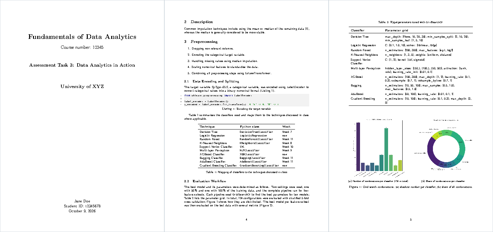

<div align="center">

# assignment-template

**A LaTeX template for assignments and reports with a title page, chapters, code listings and a bibliography**


[](https://github.com/HuberNicolas/assignment-template/actions/workflows/build.yml)


[Preview](#preview) · [Quick start](#quick-start) · [Usage](#usage) · [PDF](https://github.com/HuberNicolas/assignment-template/releases/latest)

</div>

## Features

- 🎓 Title page with course, course number, institution, optional logo, name and student ID
- 📚 One file per chapter in [`sections/`](sections), a table of contents and an appendix
- 📊 Examples for booktabs tables, a long table across pages, subfigures, aligned equations and code listings
- 🔗 `\cref` references ("Figure 2", "Table 1") and a biblatex bibliography in IEEE style
- ⚙️ Compiles with pdfLaTeX, XeLaTeX and LuaLaTeX; latexmk runs biber automatically
- 🤖 GitHub Actions builds the PDF on every push and attaches it to releases

> [!NOTE]
> Created in 2024 from a data analytics assignment and updated in 2026 (v2): the layout moved into
> `assignment.sty`, the bibliography uses biblatex and biber instead of BibTeX, tables use booktabs, and the margins
> are 2.5 cm. The example figures and numbers come from the
> [gaia-classifier](https://github.com/HuberNicolas/gaia-classifier) project.

## Contents

- [Preview](#preview)
- [Repository structure](#repository-structure)
- [Quick start](#quick-start)
- [Usage](#usage)
- [Customisation](#customisation)
- [Build in CI](#build-in-ci)
- [License](#license)
- [Author](#author)

## Preview

[](https://github.com/HuberNicolas/assignment-template/releases/latest)

## Repository structure

| Path | Content |
|---|---|
| [`main.tex`](main.tex) | Document: title page data, chapter order, bibliography |
| [`assignment.sty`](assignment.sty) | Packages, layout, title page, code listing styles and macros |
| [`sections/`](sections) | One file per chapter; `09_appendix.tex` comes after `\appendix` |
| [`references.bib`](references.bib) | Bibliography entries |
| [`assets/images/`](assets/images) | Figures used by the example |
| [`.latexmkrc`](.latexmkrc) | latexmk settings (pdfLaTeX, `main.tex`) |
| [`.github/workflows/build.yml`](.github/workflows/build.yml) | Builds the PDF and attaches it to releases |

## Quick start

### Overleaf

1. Download the repository as ZIP.
2. In [Overleaf](https://www.overleaf.com/), choose **New Project → Upload Project** and upload the ZIP.
3. Overleaf detects `main.tex` and runs biber on its own. Edit the title page in `main.tex` and the chapters in
   `sections/`.

### Local

You need a TeX distribution with `latexmk` and `biber`, e.g. [TeX Live](https://tug.org/texlive/) or
[MacTeX](https://tug.org/mactex/). A full installation contains every package the template uses.

1. Clone the repository:

   ```bash
   git clone git@github.com:HuberNicolas/assignment-template.git
   ```

2. Build the PDF (latexmk runs pdfLaTeX and biber as often as needed):

   ```bash
   latexmk
   ```

3. Rebuild on every save while you edit:

   ```bash
   latexmk -pvc
   ```

4. Remove the build files:

   ```bash
   latexmk -c
   ```

### Docker

Without a local TeX installation, build with the official TeX Live image (several GB):

```bash
docker run --rm -v "$PWD":/w -w /w texlive/texlive:latest latexmk
```

## Usage

### Title page

Set these in the preamble of [`main.tex`](main.tex); leave out any you do not need.

```latex
\course{Fundamentals of Data Analytics}
\coursenumber{12345}
\title{Assessment Task 3: Data Analytics in Action}
\institution{University of XYZ}
\logo{assets/images/logo.png}  % optional
\author{Jane Doe}
\studentid{12345678}
\date{\today}
```

The template ships without university logos: they are trademarks of the universities and not covered by the license.
Add your institution's logo to `assets/images/` if you may use it.

### Chapters

Add a file to [`sections/`](sections) and include it in `main.tex` with `\input{sections/04_results}`.

### Commands

| Command | Result |
|---|---|
| `\cite{key}` | Citation in IEEE style, e.g. [1]; entries live in `references.bib` |
| `\cref{fig:x}`, `\Cref{tab:y}` | "Figure 2", "Table 1" (capitalised `\Cref` at the start of a sentence) |
| `\begin{lstlisting}[style=python, caption={…}, label={lst:x}]` | Code listing; styles `python` and `bash` |
| `\col{name}`, `\filename{name}` | Column or variable name (italic), file name (monospace) |
| `\ie`, `\eg`, `\etal`, `\cf` | *i.e.,* *e.g.,* *et al.* *cf.* with correct spacing |
| `\highlight{text}` | Text on an orange background, e.g. for open points |
| `\ar` | → in running text |
| `\ding{51}`, `\ding{55}` | ✓ and ✗ in tables |

## Customisation

| What | Where |
|---|---|
| Font size | Class option: `\documentclass[10pt]{article}` |
| Margins | `\geometry{margin=2cm}` in the preamble of `main.tex` |
| Language | `babel` option in `main.tex` (`english`, `ngerman`, …); load it before `assignment` |
| Citation style | `style=ieee` in the `biblatex` line of [`assignment.sty`](assignment.sty), e.g. `style=numeric` or `style=authoryear` |
| Code colors and listing layout | `\lstset` and the `code-…` colors in [`assignment.sty`](assignment.sty) |
| Title page layout | `\maketitle` in [`assignment.sty`](assignment.sty) |

Remove `\usepackage{blindtext}` from `main.tex` once you replace the dummy text.

## Build in CI

[`build.yml`](.github/workflows/build.yml) compiles `main.tex` with
[xu-cheng/latex-action](https://github.com/xu-cheng/latex-action) on every push and pull request and uploads the PDF
as a workflow artifact. Pushing a tag `v*` also attaches the PDF to a GitHub release.

## License

[GNU General Public License v3.0](LICENSE) © 2024 Nicolas Huber. Modified versions of the template must also be
released under the GPLv3 and keep the copyright notice. The example figures are from
[gaia-classifier](https://github.com/HuberNicolas/gaia-classifier); the cited article belongs to its authors.

## Author

**Nicolas Huber** · [GitHub](https://github.com/HuberNicolas)
